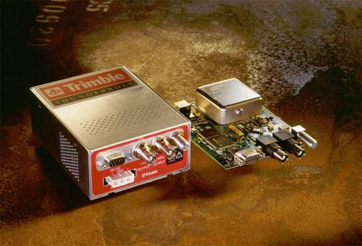

= Trimble Palisade/Thunderbolt/Acutime/Resolution SMT/ACE III/Copernicus & Praecis Receivers
include::include-html.ad[]

[width="100%",cols="<50%,<50%",frame="none",grid="none"]
|==============================================================
|  | 
|==============================================================

== Synopsis
["verse",subs="normal"]
Name: trimble
Reference ID: GPS
Serial Port: /dev/trimble__u__; 9600/38400 bps 8N1/8O1

== Description

The *refclock trimble* driver version 4.01 supports
ftp://ftp.trimble.com/pub/sct/embedded/bin/Manuals/Old%20Manuals/PALISADE.PDF[Trimble
Navigation's Palisade Smart Antenna GPS receiver], Thunderbolt, Acutime 2000,
Acutime Gold, Resolution SMT, ACE III and Copernicus II.
The EndRun Technologies Praecis Cf, Ct, Ce, and II modules
(in Palisade emulation mode) are also supported.

There are a number of different Trimble receivers with "Resolution" as part of their name.
The particular receiver supported by this driver is the "Resolution SMT", part number 66974-45.
This receiver returns hardware code 3009 decimal when queried by a TSIP Hardware Component
Information command packet.  It may also support the "Resolution T" receiver (hardware code 3002
decimal) but has not been tested on that device.

== Tested Receivers
Driver version 4.01 has been tested with the following receivers on the four
host machines listed in the "Host#" table.

[options="header,autowidth"]
|====
| Model                      | FW Ver | Event In? | PPS width
| ACE III 39818-00-C         | 8.08   | N         | 10 us
| Acutime 2000 39091-00      | 2.02   | Y         | 10 us
| Acutime Gold 55238-00      | 1.12   | Y         | 10 us
| Copernicus II 63530-00     | 1.07.1 | N         | 5 us
| Palisade 26664-00          | 7.12   | Y         | 1 us
| Praecis Cf 3001-0000-000   | 2.21   | Y         | 1 ms
| Praecis II 3002-0001-000   | 1.05   | Y         | 1 ms
| Thunderbolt 48051-61       | 3.00   | N         | 10 us
| Resolution SMT 66974-45    | 1.14   | N         | 125 us
| Resolution SMTx 99889-00   | 2.02   | N         | 125 us
|====

Model Notes: +
1. Models without an event input were tested with the
link:driver_pps.html[+pps+] driver active. +
2. Praecis models tested using a CDMA simulator (refer to the
xref:Pra[Praecis] notes.) +
3. The Resolution SMTx 99889-00 was also available on a carrier board as part
number 66974-75. +

[options="header,autowidth"]
|====
| Host# | Machine            | Operating System     | Serial Port
| 1     | Dell Precision 7910| Gentoo (amd64)       | Onboard,SIIG CyberPro v5
| 2     | Raspberry Pi 3 B   | Raspberry Pi OS Lite | Onboard full UART
| 3     | Sun Ultra 5        | Tribblix m31 SPARC   | Onboard UART
| 4     | Power Mac G4 MDD   | FreeBSD 14.3         | Startech PCI1S550
|====

Host Notes, by Host#: +
1. e5-2667v3, motherboard clock replaced with OCXO +
2. 32-bit Debian 12, using UART0. 3.3VDC receivers connected directly to GPIO
pins, others connected with a Maxim MAX3232 level converter (the pps-gpio
assert_falling_edge option can be used if an inverter is installed at the
receiver-side level converter) +
3. 1GB RAM (FDD removed), Tribblix is an illumos distribution based on SunOS
5.11, onboard UART supports only assert (rising) PPS edge with minimum +V
width of 20 microseconds and minimum off time (at -V) of 0.3 microseconds so
receivers with short PPS widths need a pulse stretcher or inversion and delay
compensation +
4. Order# M9309, motherboard clock replaced with OCXO +

[[sym]]
== Operating System Serial Port Configuration

The driver attempts to open the device /dev/trimble__u__ where 'u' is
the NTP refclock xref:un[unit number], or the LSB of the refclock
address when using the legacy syntax.

The user must provide a symbolic link to an available serial port device. This
is typically performed by a command such as:

[width="50%",cols="<35%,<65%",options="header"]
|=================================================
|OS              | Command
|FreeBSD         | ln -s /dev/ttyu0 /dev/trimble0
|Linux           | ln -s /dev/ttyS0 /dev/trimble0
|Solaris         | ln -s /dev/term/a /dev/trimble0
|Raspberry Pi OS | ln -s /dev/ttyAMA0 /dev/trimble0
|=================================================

The receivers supported by this driver have a factory default serial port
configuration of 8O1 (odd parity) except the Thunderbolt and Copernicus II which
default to 8N1 (no parity).  They have a factory default serial port
speed of 9600 baud except the Copernicus II which defaults to 38400 baud.
The driver automatically sets the baud rate and parity of the host to
match the receiver's factory default values.

[[cfg]]
== NTP Configuration Examples

NTP configuration file "{ntpconf}"

---------------------------------
refclock trimble unit X subtype Y
---------------------------------

or

---------------------------------------------
refclock trimble unit X subtype Y time1 Z.ZZZ
---------------------------------------------

Substituting an appropriate unit number for X. For subtype Y refer to this table:

[width="50%",cols="<50%,<50%",options="header"]
|=================================
| subtype | Model
| 0 |  Palisade
| 1 |  Praecis
| 2 |  Thunderbolt
| 3 |  Acutime 2000 & Acutime Gold
| 5 |  Resolution SMT
| 6 |  ACE III
| 7 |  Copernicus II
|=================================

Use the 'time Z.ZZZ' option if the delay introduced by decoding of serial messages from the receiver causes the reference clock to appear to be offset compared with other time sources.
(If the reference clock appears to have an offset of -50ms for example, set time1 to +0.05.)

== Initial Setup and Testing for Palisade / Acutime Receivers
1.  Read the xref:Pal[Palisade / Acutime] notes.
2.  Place the GPS receiver outdoors, with a clear view of the sky for best
    results -- these receivers do not work well indoors.
3.  Power up and allow the receiver to obtain UTC offset data. This can take
    13 to 30 minutes with outdoor placement, or up to a few hours indoors.
4.  Optionally wait for the receiver to pulse its PPS output. The 'PPS' LED
    will blink if using an interface module; this indicates that the receiver
	has entered a state that is usable by the driver.
..  If the PPS is not produced after a few hours: The antenna placement may be
    suboptimal, the signal level mask values are too high, or PPS was disabled in the
    receiver. Relocate to a better position, or reset the receiver's
	configuration to factory defaults.
5.  Connect the host to 'Port A'.
6.  Configure the serial I/O port and its xref:sym[symbolic link] on the host.
7.  Add the refclock to your +ntpd+ xref:cfg[configuration file] with
    xref:f1[+flag1+] set to 1.
8.  Run +ntpd+ without detaching from the terminal (-n).
9.  Check the ntpd xref:log[event log] or stdout for a line similar to
    'TRIMBLE(0) open at /dev/trimble0' to verify that your serial port opened.
10. The driver will print +INFO: decode+ lines to stdout as it processes
    message packets from the receiver.
..  Check your serial connection if 'ERROR: trimble_poll: no packets found'
    appears.
..  If no +INFO: decode+ lines are seen within 60s the event
    triggering method may be incorrect, check your xref:f3[+flag3+] setting.
    It's also possible that the receiver is misconfigured: try resetting it to
    factory defaults.
... The driver will print the message
    'ERROR: trimble_poll: packet(s) found but none were usable.' to stdout if
    xref:f3[+flag3+] is incorrect, and also if the host is connected to
    Port B.
11. The driver will print an +INFO: trimble_receive+ line with a
    timecode to stdout when time is successfully transferred.
..  If +INFO: decode+ lines are seen but +INFO: trimble_receive+ never
    appears:
... +INFO: decode+ lines with 'Tracking n SVs' display the number of usable
    satellites. At least four must be tracking if the receiver does not have
    a valid stored position, but only one is needed if it does.
... +ERROR: decode+ lines with 'unusable tracking status' will appear if there
    are insufficient usable satellites.
12. Once operation appears correct, remove xref:f1[+flag1+] from the +ntpd+
    configuration file, and optionally add xref:f4[+flag4+].

== Initial Setup and Testing for Thunderbolt Receivers
1.  Read the xref:TB[Thunderbolt] notes.
2.  Place the GPS antenna outdoors, with a clear view of the sky for best
    results -- Thunderbolt is not very good at tracking weak signals.
3.  Power up and allow the receiver to obtain UTC offset data. This can take
    13 to 30 minutes with outdoor placement, or up to a few hours indoors.
4.  Configure the serial I/O port and its xref:sym[symbolic link] on the host.
5.  Add the refclock to your +ntpd+ xref:cfg[configuration file] with
    xref:f1[+flag1+] set to 1.
6.  Run +ntpd+ without detaching from the terminal (-n).
7.  Check the ntpd xref:log[event log] or stdout for a line similar to
    'TRIMBLE(0) open at /dev/trimble0' to verify that your serial port opened.
8.  The driver will print +INFO: decode+ lines to stdout as it processes
    message packets from the receiver.
..  Check your serial connection if 'ERROR: trimble_poll: no packets found'
    appears.
... The driver may print the message
    'ERROR: trimble_poll: packet(s) found but none were usable.' to stdout if
    it failed to reconfigure the receiver to transmit auto-report
    superpackets.
9.  The driver will print an +INFO: trimble_receive+ line with a timecode to
    stdout when time is successfully transferred.
..  If +INFO: decode+ lines are seen but +INFO: trimble_receive+ never
    appears:
... +ERROR: decode+ lines with 'not in holdover...unusable' will appear if
    there are insufficient usable satellites and the receiver is not in
    holdover.
... +ERROR: decode+ lines with 'unit in holdover...exceeds time2' will appear
    if unit has been in holdover for more than xref:t2[+time2+] seconds.
... +ERROR: decode+ lines with 'misconfigured' will appear if the driver
    failed to reconfigure the receiver at startup.
10. Once operation appears correct, remove xref:f1[+flag1+] from the +ntpd+
    configuration file, and optionally add xref:f4[+flag4+].

== Initial Setup and Testing for Praecis Receivers
1.  Read the xref:Pra[Praecis] notes.
2.  Power up and allow the receiver to lock with a cell tower. This can take
    a few minutes if the unit has been powered on recently and has good
	reception, but may take much longer with poor reception or if the unit has
	been powered off for many months.
3.  Configure the serial I/O port and its xref:sym[symbolic link] on the host.
4.  Add the refclock to your +ntpd+ xref:cfg[configuration file] with
    xref:f1[+flag1+] set to 1.
5.  Run +ntpd+ without detaching from the terminal (-n).
6.  Check the ntpd xref:log[event log] or stdout for a line similar to
    'TRIMBLE(0) open at /dev/trimble0' to verify that your serial port opened.
7.  The driver will print +INFO: decode+ lines to stdout as it processes
    message packets from the receiver.
..  Check your serial connection if 'ERROR: trimble_poll: no packets found'
    appears, and ensure that xref:f3[+flag3+] is not set.
8.  The driver will print an +INFO: trimble_receive+ line with a timecode to
    stdout when time is successfully transferred.
..  If the time data has random large offsets the receiver's CTIME is probably
    set ON. See the Praecis manual for the command to change this setting.
9.  Once operation appears correct, remove xref:f1[+flag1+] from the +ntpd+
    configuration file, and optionally add xref:f4[+flag4+].

== Initial Setup and Testing for Resolution SMT Receivers
1.  Read the xref:Res[Resolution SMT] notes.
2.  Power up and allow the receiver to obtain UTC offset data. This can take
    13 to 30 minutes.
3.  Configure the serial I/O port and its xref:sym[symbolic link] on the host.
4.  Add the refclock to your +ntpd+ xref:cfg[configuration file] with
    xref:f1[+flag1+] set to 1.
5.  Run +ntpd+ without detaching from the terminal (-n).
6.  Check the ntpd xref:log[event log] or stdout for a line similar to
    'TRIMBLE(0) open at /dev/trimble0' to verify that your serial port opened.
7.  The driver will print +INFO: decode+ lines to stdout as it processes
    message packets from the receiver.
..  Check your serial connection if 'ERROR: trimble_poll: no packets found'
    appears.
... The driver may print the message
    'ERROR: trimble_poll: packet(s) found but none were usable.' to stdout if
    it failed to reconfigure the receiver to transmit auto-report
    superpackets.
8.  The driver will print an +INFO: trimble_receive+ line with a timecode to
    stdout when time is successfully transferred.
..  If +INFO: decode+ lines are seen but +INFO: trimble_receive+ never
    appears:
... +ERROR: decode+ lines with 'misconfigured' will appear if the driver
    failed to reconfigure the receiver at startup.
9.  Once operation appears correct, remove xref:f1[+flag1+] from the +ntpd+
    configuration file, and optionally add xref:f4[+flag4+].

== Initial Setup and Testing for ACE III Receivers
1.  Read the xref:ACE[ACE III] notes.
2.  Place the GPS antenna outdoors, with a clear view of the sky for best
    results -- ACE III is not very good at tracking weak signals.
3.  Power up and allow the receiver to obtain UTC offset data. This can take
    13 to 30 minutes.
4.  Configure the serial I/O port and its xref:sym[symbolic link] on the host.
5.  Add the refclock to your +ntpd+ xref:cfg[configuration file] with
    xref:f1[+flag1+] set to 1.
6.  Run +ntpd+ without detaching from the terminal (-n).
7.  Check the ntpd xref:log[event log] or stdout for a line similar to
    'TRIMBLE(0) open at /dev/trimble0' to verify that your serial port opened.
8.  The driver will print +INFO: decode+ lines to stdout as it processes
    message packets from the receiver.
..  Check your serial connection if 'ERROR: trimble_poll: no packets found'
    appears.
9.  The driver will print an +INFO: trimble_receive+ line with a timecode to
    stdout when time is successfully transferred.
10. Once operation appears correct, remove xref:f1[+flag1+] from the +ntpd+
    configuration file, and optionally add xref:f4[+flag4+].

== Initial Setup and Testing for Copernicus II Receivers
1.  Read the xref:Cop[Copernicus II] notes.
2.  Power up and allow the receiver to obtain UTC offset data. This can take
    13 to 30 minutes.
3.  Configure the serial I/O port and its xref:sym[symbolic link] on the host.
4.  Add the refclock to your +ntpd+ xref:cfg[configuration file] with
    xref:f1[+flag1+] set to 1.
5.  Run +ntpd+ without detaching from the terminal (-n).
6.  Check the ntpd xref:log[event log] or stdout for a line similar to
    'TRIMBLE(0) open at /dev/trimble0' to verify that your serial port opened.
7.  The driver will print +INFO: decode+ lines to stdout as it processes
    message packets from the receiver.
..  Check your serial connection if 'ERROR: trimble_poll: no packets found'
    appears.
8.  The driver will print an +INFO: trimble_receive+ line with a timecode to
    stdout when time is successfully transferred.
9.  Once operation appears correct, remove xref:f1[+flag1+] from the +ntpd+
    configuration file, and optionally add xref:f4[+flag4+].

[[log]]
== Event Logging

System and Event log entries are generated by NTP to report significant
system events. Administrators should monitor the system log to observe
NTP error messages. Log entries generated by the driver will be of the form:

-------------------------------------------------------
09-17T01:36:56 ntpd[1127]: REFCLOCK: TRIMBLE(0) message
-------------------------------------------------------

[[stats]]
Standard-format link:monopt.html#cmd[+clockstats file+] log entries are
generated by the driver once every polling interval by default. Additional
+clockstats file+ entries can be generated by setting xref:f1[+flag1+] or
xref:f4[+flag4+] to 1. Flag4 will generate messages only if an error that
prevents normal operation occurs, so it may be useful to set flag4 to 1 in
your configuration file. Flag1 generates a large amount of informational
messages (up to 1 kilobyte per second), so it should be set to 1 only during
setup or troubleshooting. If ntpd is started with the -n option the driver
will also print the flag1 and flag4 messages to stdout.

Flag1 and flag4 can be changed while ntpd is running by using the
link:ntpq.html[+ntpq utility+]. Note that link:ntpkeygen.html[+ntpkeygen+]
authentication keys must be present, and the
link:authentic.html#mac[+controlkey+] and
link:accopt.html#unrestrict[+unrestrict nomodify+] must be configured.

An example command which changes flag 1 to 1 on unit #0 when the controlkey is
set to 1 is: +
ntpq -a 1 -c ":config fudge 127.127.29.0 flag1 1" +
Note 1: The unit number is the last digit of the IPv4-formatted address. +
Note 2: If an ntpq :config command has a syntax error the server may return
the confusing error message of +"***Server error code PERMISSION"+ +

== Driver Options
[[un]]+unit+ 'number'::
  Specifies the receiver number, with default 0. Used as an identifier so that
  the driver can control multiple receivers.

[[t1]]+time1+ 'time'::
  Specifies the time offset calibration factor, in seconds and fraction,
  with default 0.0.

[[t2]]+time2+ 'time'::
  Specifies the holdover duration for Thunderbolt, in seconds, with
  default 0 (holdover disabled).

+stratum+ 'number'::
  Specifies the driver stratum, in decimal from 0 to 15, with default 0.

+refid+ 'string'::
  Specifies the driver reference identifier, an ASCII string from one to
  four characters, with default +GPS+. When using a Praecis this should be
  set to +CDMA+.

[[f1]]+flag1 {0 | 1}+::
  Enables logging error and informational messages to the
  xref:stats[+clockstats file+] when set to 1.

+flag2 {0 | 1}+::
  Not used by this driver. NOTE: Versions of the driver before 3.00 used flag2
  to disable hardware event capture. Event capture is now required for all
  receivers except the Thunderbolt, Resolution SMT and Copernicus II.

[[f3]]+flag3 {0 | 1}+::
  Specifies the method used for triggering the receiver's hardware event input.
  The default of 0 uses the serial port RTS line. Set to 1 to use the serial
  port's TXD line instead of RTS. Value is ignored when using a Thunderbolt, 
  Resolution SMT, ACE III or Copernicus II.

[[f4]]+flag4 {0 | 1}+::
  Enables logging error messages to the xref:stats[+clockstats file+] when set
  to 1.

[[st]]+subtype+ 'number'::
  Specifies the receiver model, default is 0:
[width="60%",cols="^20%,<80%",options="header"]
|================================
| # | Model
| 0 | Palisade
| 1 | Praecis
| 2 | Thunderbolt
| 3 | Acutime 2000 & Acutime Gold
| 5 | Resolution SMT
| 6 | ACE III
| 7 | Copernicus II
|================================
note: There is currently no difference between subtype 0 and subtype 3 other
than the driver startup message.

+mode+ 'number'::
  Synonym for subtype, retained for backward compatibility.

+path+ 'filename'::
  Overrides the default device path.

+ppspath+ 'filename'::
  Not used by this driver.

+baud+ 'number'::
  Overrides the default baud rate.

[[Pal]]
== Palisade / Acutime Notes

The driver uses the receiver's 'external event' input and 'Port A' TSIP output
packets for time transfer, so use the 'Port A' RS232 connector. Operation with
'Port B' is not supported. The event input must be attached to the host serial
port's RTS or TXD lines -- set xref:f3[+flag3+] accordingly. The host will
pulse the event input which will cause the receiver to emit a timestamp packet.
Jitter of less than 400 ns has been observed with a Palisade on a machine with
'-24 precision' using a 16550-compatible serial port and RTS for event
triggering.

The Palisade, Acutime 2000 and Acutime Gold are typically used with a
'Synchronization Interface Module' which converts the receiver's RS422 I/O
lines to RS232. Generic RS422 to RS232 adapters will also work. Current part
numbers for the 12-pin antenna connector: DEUTSCH IMC26-2212X body,
6862-201-22278 pins, and IMC2AD backshell. See the receiver manual for pinouts.
If you opt to build your own interface with RTS triggering, ensure that
positive voltage on the RS232 RTS line produces positive voltage on the Port A
Receive+ line.

The module supplied by Trimble for the Palisade and Acutime 2000, and the
TrimTim modules available from http://www.navox.pl[Navimor Oxer] have two RS232
ports which allow a host to communicate with the receiver's 'Port A' and
'Port B'. With these modules the PPS is not connected to either RS232 port,
but is made available on a BNC connector. The RS232 connector routed to 'Port A'
connects the host's RTS line to the receiver's 'external event' input, so the
host's TXD line is not connected. Since data can't be transmitted from the host
to the receiver because of the unconnected TXD line, the driver expects the
receiver to be set to its factory default configuration.

If resetting the receiver to defaults is not desired, verify that 'time base'
is set to UTC in 8e-4a. For the Palisade, verify that 8e-0b is 2 or 3 and
8e-ad is 2 or 3. For the Acutimes, verify that the 8e-a5 packet mask has at
least 'Event 8f-0b on Port A' and 'Event 8f-ad on Port A' enabled.

If it is not possible to use the external event input with your interface and
you have an Acutime Gold or Acutime 2000, try using the
link:driver_gpsd.html[+gpsd+] driver instead.

The supported receivers will have 'GPS Week Number Rollover' problems after the
following dates:
[width="50%",cols="<50%,<50%",options="header"]
|=============================
| Model        | Rollover Date
| Palisade     | 17-Nov-2018
| Acutime 2000 | 5-Aug-2018
| Acutime Gold | 1-Sep-2029
|=============================

A workaround for this has been implemented in the driver which relies on the
ntpd program build date. Ensure that the build date reported during ntpd
startup is less than 19 years from the current date.

Palisade firmware versions previous to 7.12 are untested.
The Palisade 26664-00 with pre-7.12 firmware must be upgraded to 7.12 because
pre-7.12 firmware versions disable the receiver's external event input.
Firmware version 7.12 for all Palisade receivers is available at:
ftp://ftp.trimble.com/pub/sct/timing/

The Acutime Gold Starter Kit contains a USB interface module. This driver has
been tested using an RS232 interface module so the performance of the USB
version is unknown. Navimor Oxer recommends that the USB port on their IF2
module not be used for precision timing. This is likely also true for the
Trimble interface. xref:f3[+Flag3+] may need to be set when using a USB
interface.

Refer to the manuals for hardware setup instructions, cable pinouts and packet
formats. The manuals are available at:
ftp://ftp.trimble.com/pub/sct/embedded/bin/Manuals/

The Palisade can't automatically save its self-survey position. It must
perform a self-survey every time power is lost unless its
'accurate initial position' is manually set. Once set, the receiver will power
up with this position and skip its self-survey. The driver does not wait for
the self-survey to complete before allowing time transfer.

Acutime 2000 transmits incorrect position data in its event-trigger response,
so the TSIP_decode Latitude / Longitude / Altitude debugging message will not
display correctly.

The receiver must know the current UTC offset from GPS time to be usable with
ntpd. The receiver automatically decodes the UTC offset data from the +Almanac+
transmitted by GPS satellites. With good antenna placement, Almanac
reception can be expected to take 13 minutes or more after receiver power-up.
The driver will wait for the receiver to report that its UTC offset is valid
before enabling time transfer. The receiver stores the UTC offset in NVRAM so
it will become usable before the Almanac is available, but if it was powered
off during a leap second change the stored offset may be incorrect until the
current Almanac is obtained.

[[Pra]]
== EndRun Technologies Praecis Notes

The driver has been tested with a Praecis Cf. The Ct, Ce, and Praecis II
should also work. The receiver must be set to use Trimble emulation mode.
To configure the receiver, see:
https://net.its.hawaii.edu/network-performance/using-praecis/
NTP setup instructions are also in the receiver manuals, which can be found at:
https://www.endruntechnologies.com/documentation.htm

Check the receiver's LEAP setting. Incorrect values will cause a time offset.
See the note for this command in the receiver manual.

Jitter of less than 100 ns has been observed with a Praecis Cf on a machine with
'-24 precision' using a 16550-compatible serial port and RTS for event
triggering, but the offset relative to a Palisade on the same machine may vary
in steps by several microseconds, likely due to the receiver switching between
cell towers.

NOTE: CDMA services are no longer available in the current driver maintainer's
area, so as of driver version 4.01, testing is performed using the
JRC NJZ-1800BJ simulator.

IMPORTANT: Turn off the receiver's auto-report feature (CTIME=OFF) because the
driver can't distinguish auto-reports from event capture responses. This is
mentioned in the receiver manual.

[[TB]]
== Thunderbolt Notes

The driver will attempt to set the time report packet and PPS output alignment
to UTC time since the Thunderbolt defaults to GPS alignment. Time transfer will
not be allowed unless the receiver reports that it has received the leap second
offset between GPS and UTC time and is outputting UTC time.

The Thunderbolt does not have an event input. Initially it was thought that
the firmware could be upgraded to enable event input so that it would operate
with this driver in a way similar to a Palisade or Acutime, but no upgrade was
ever released. The Thunderbolt's serial port CTS line is not connected with the
standard board configuration, and there is no mention of event capability in
any documentation. Newer receivers in the Thunderbolt line also do not have
event inputs. Here is a link explaining the firmware situation:
https://lists.ntp.org/pipermail/hackers/2006-April/002216.html

Due to the lack of an event input the driver uses the timecode packet
transmitted by the Thunderbolt shortly after the beginning of each second, but
this packet is not very well aligned: delay varies from 7 ms to 32 ms depending
on the number of satellites the receiver is attempting to track, and the delay
is not included in the timecode. For this reason the xref:t1[+time1+] should be
set to about 20 ms. The link:driver_pps.html[+pps+] driver should be used along
with this driver for best results, but a hardware modification is required to
route the receiver's 1PPS output to the serial port DCD line for serial PPS.

The Thunderbolt will have a "GPS Week Number Rollover" problem after
30-Jul-2017. The same workaround mentioned in the
xref:Pal[Palisade / Acutime Notes] section is implemented for the Thunderbolt.

The receiver must know the current UTC offset from GPS time to be usable with
ntpd. The receiver automatically decodes the UTC offset data from the +Almanac+
transmitted by GPS satellites. With good antenna placement, Almanac reception
can be expected to take 13 minutes or more after receiver power-up. The driver
will wait for the receiver to report that its UTC offset is valid before
enabling time transfer.

Time transfer during holdover may be enabled by setting xref:t2[time2] to the
maximum allowable holdover duration in seconds.

[[Res]]
== Resolution SMT Notes

The driver will attempt to set the time report packet and PPS output alignment
to UTC time since the Resolution SMT defaults to GPS alignment. Time transfer will
not be allowed unless the receiver reports that it has received the leap second
offset between GPS and UTC time and is outputting UTC time.  The
driver will also set the receiver not to output a PPS unless at least one
satellite is being received.

The Resolution SMT does not have an event input.  The driver therefore uses the
timecode packets transmitted by the receiver after the beginning of each
second.  It takes approximately 0.42s to receive the primary and secondary
timecode packets.  For this reason the xref:t1[+time1+] should be
set to about 420 ms. The link:driver_pps.html[+pps+] driver should be used along
with this driver for best results.

The Resolution SMT will have a "GPS Week Number Rollover" problem after
the following dates:
[width="50%",cols="<50%,<50%",options="header"]
|=============================
| F/W version  | Rollover Date
| pre-v1.14    | 19-Jun-2027
| v1.14        | 10-May-2031
| v2.02        | 21-Aug-2032
|=============================
The same workaround mentioned in the
xref:Pal[Palisade / Acutime Notes] section is implemented for the Resolution SMT.

The receiver must know the current UTC offset from GPS time to be usable with
ntpd. The receiver automatically decodes the UTC offset data from the +Almanac+
transmitted by GPS satellites. With good antenna placement, Almanac reception
can be expected to take 13 minutes or more after receiver power-up. The driver
will wait for the receiver to report that its UTC offset is valid before
enabling time transfer.

[[ACE]]
== ACE III Notes

The ACE III does not have an event input.  Rather, the receiver is polled
by the driver transmitting a 0x21 command to the receiver every second.  The
link:driver_pps.html[+pps+] driver should be used along
with this driver for best results.

The timecode packet output by the ACE III contains only the GPS week number,
time within the week and UTC offset.  A "GPS Week Number Rollover" workaround
is therefore needed to convert the reported time to UTC.  The same
workaround mentioned in the xref:Pal[Palisade / Acutime Notes] section is
implemented for the ACE III.

The receiver must know the current UTC offset from GPS time (caused by insertion or
deletion of leap seconds in UTC) to be usable with
ntpd. The receiver automatically decodes the UTC offset data from the +Almanac+
transmitted by GPS satellites. With good antenna placement, Almanac reception
can be expected to take 13 minutes or more after receiver power-up. The driver
will wait for the receiver to report that its UTC offset is valid before
enabling time transfer.

[[Cop]]
== Copernicus II Notes

The Copernicus II does not have an event input.  The driver therefore uses the
timecode packet transmitted by the Copernicus II after the beginning of each
second.  It takes approximately 0.14s to receive the timecode packet.
For this reason the xref:t1[+time1+] should be set to about 140 ms.
The link:driver_pps.html[+pps+] driver should be used along
with this driver for best results.

The timecode packet output by the ACE III contains only the GPS week number,
time within the week and UTC offset.  A "GPS Week Number Rollover" workaround
is therefore needed to convert the reported time to UTC.  The same
workaround mentioned in the xref:Pal[Palisade / Acutime Notes] section is
implemented for the Copernicus II.

The receiver must know the current UTC offset from GPS time (caused by insertion or
deletion of leap seconds in UTC) to be usable with
ntpd. The receiver automatically decodes the UTC offset data from the +Almanac+
transmitted by GPS satellites. With good antenna placement, Almanac reception
can be expected to take 13 minutes or more after receiver power-up. The driver
will wait for the receiver to report that its UTC offset is valid before
enabling time transfer.

== Change Log
Since version 3.00 (2017-23-09) +
4.01 +
* use fudge flag 1 and fudge flag 4 to activate troubleshooting messages +
4.00 +
* add support for Resolution SMT, ACE III and Copernicus II receivers +

Since version 2.45 (2008-30-09) +
3.00 +
* add GPS week number rollover workaround +
* remove support for using the Palisade, Acutime 2000, Acutime Gold and
* Praecis without event triggering (due to the GPS week number rollover
  workaround) +
* add flag3 to select event triggering method +
* simplify debugging messages +
* allow for time transfer during Thunderbolt holdover +
* check serial parity for receivers that generate parity by default +

== Authors
mailto:trv-n@comcast.net[*Questions or Comments : ntpsec, driver version 3.00+*]

mailto:sven_dietrich@trimble.com[*Sven-Thorsten Dietrich*] +
  645 North Mary Avenue +
  Post Office Box 3642 +
  Sunnyvale, CA 94088-3642 +

mailto:fernandoph@iar.unlp.edu.ar[*Fernando P. Hauscarriaga*] +
  https://www.iar.unlp.edu.ar/~fernandoph +
  Instituto Argentino de Radioastronomia +
  https://www.iar.unlp.edu.ar +

'''

include::includes/footer.adoc[]
